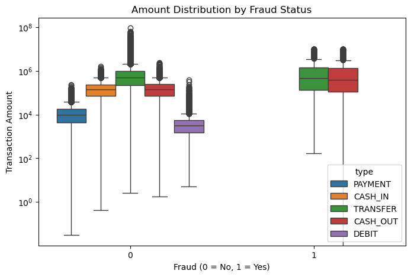
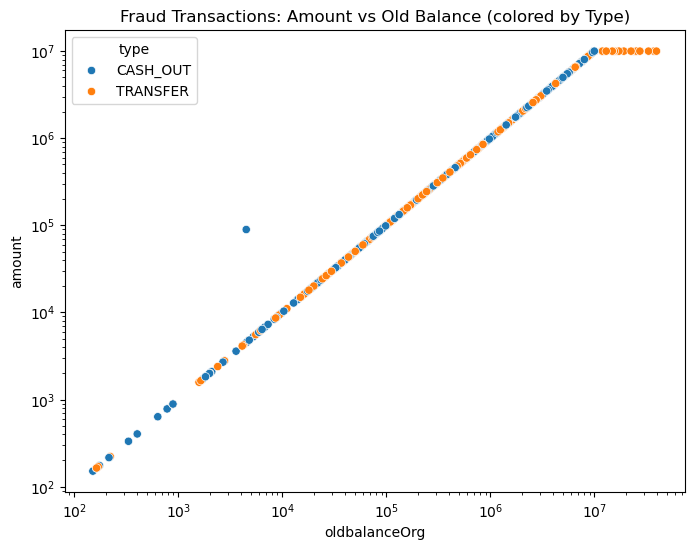
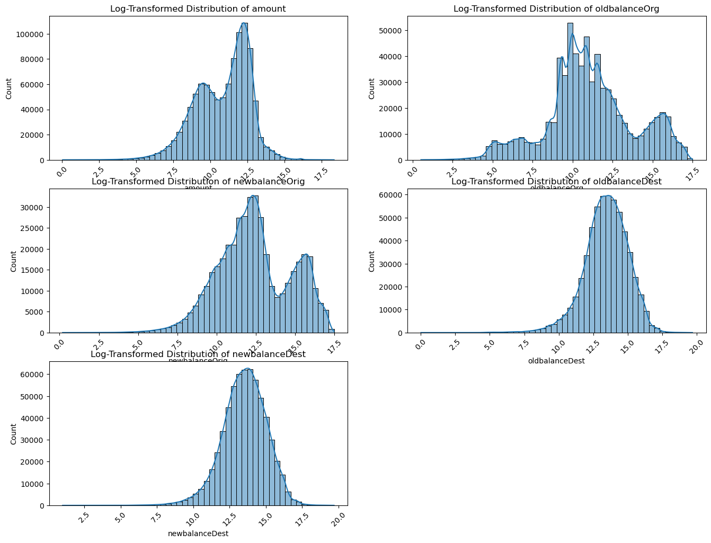
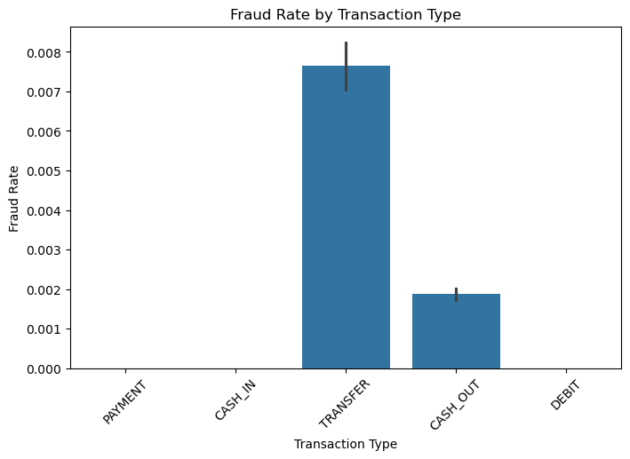
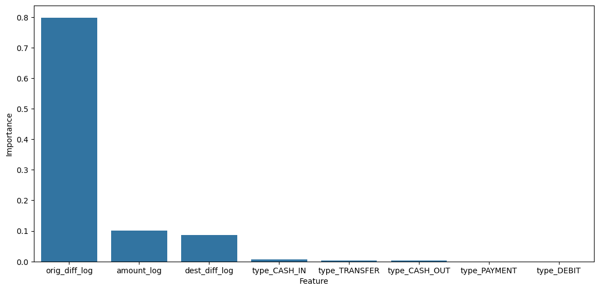

# Fraud Detection Using Machine Learning at Caishen Bank

## 🧠 Project Overview

Caishen Bank, a Zurich-based financial institution, has pledged to catch **99% of all fraudulent transactions** within the next 3 years. To do so, the Data Science team must create a **machine learning pipeline** capable of identifying fraudulent activity from over 1 million historical transactions.

This project walks through the **EDA → Feature Engineering → Model Training & Evaluation** steps for binary classification using an imbalanced dataset.

---

## 📁 Dataset Information

The dataset contains **bank transactions** with fields such as:
- `type`: Type of transaction (TRANSFER, CASH_OUT, etc.)
- `amount`: Amount of transaction
- `oldbalanceOrg`, `newbalanceOrig`, `oldbalanceDest`, `newbalanceDest`: Balance details for origin and destination accounts
- `isFraud`: Target column (1 = Fraudulent, 0 = Non-fraudulent)
- `isFlaggedFraud`: System-flagged threshold > 200,000

---

## 🔍 Exploratory Data Analysis (EDA)

### Distribution Insights

Most numerical features are **right-skewed**, requiring **log transformation** before modeling. We also observe that fraudulent transactions are rare and concentrated in specific transaction types.

📊 **Amount by Fraud Status**

📈 **Transaction Amount vs Origin Balance**

📉 **Numerical Log-Scaled Distributions**

---

### Fraud Breakdown

Some transaction types are **far more prone** to fraud than others:

- **TRANSFER** and **CASH_OUT** are responsible for nearly **all fraud cases**.
- DEBIT, CASH_IN, and PAYMENT show almost no fraud.

📌 **Fraud Rate by Transaction Type**

---

## 🧰 Feature Engineering

We engineered meaningful features to expose abnormal fund movement patterns:

- `orig_diff = oldbalanceOrg - newbalanceOrig`
- `dest_diff = newbalanceDest - oldbalanceDest`

Negative values (often placeholders for missing activity) were clipped to zero.

🧮 **Log Transformations** were applied to:
- `amount`, `orig_diff`, `dest_diff`

This helped reduce skewness and aligned numerical scales.

---

## 🧠 Modeling Approach

### Data Preprocessing

- Used `ColumnTransformer` with:
  - `StandardScaler` for numerical features
  - `OneHotEncoder` for transaction type
- Removed identifiers: `nameOrig`, `nameDest`

### Dealing with Imbalance

We used **SMOTE (Synthetic Minority Over-sampling Technique)** to upsample the minority fraud class without duplication, ensuring better learning signal.

---

## ⚙️ Models & Metrics

We implemented and tuned:

| Model              | Strengths |
|-------------------|-----------|
| LogisticRegression | Explainable, linear baseline |
| RandomForestClassifier | Handles feature interaction, robust |
| XGBoostClassifier   | Highly accurate, works well on imbalanced data |

Evaluated on:
- **Recall** – Important to catch fraudulent cases
- **Precision** – Important to avoid false alarms
- **F1 Score** – Balance between both

---

## 📊 Feature Importance (XGBoost)

The model identified `orig_diff_log` as **the most influential feature** for predicting fraud:

---

## 🧾 Conclusion

- Fraud detection is complex due to **class imbalance**, **skewed data**, and **domain-specific behaviors**.
- Proper **EDA**, **feature engineering**, and **imbalance handling (SMOTE)** can significantly enhance model effectiveness.
- Our models demonstrate strong potential to detect malicious activity in real-world banking systems.
## ⚙️ Models & Metrics

We implemented and tuned:

| Model                | Strengths                                |
|---------------------|-------------------------------------------|
| LogisticRegression   | Explainable, linear baseline              |
| RandomForestClassifier | Handles feature interaction, robust     |
| XGBoostClassifier     | Highly accurate, works well on imbalanced data |

We evaluated models using:

- **Recall** – Important to catch fraudulent cases
- **Precision** – Important to avoid false alarms
- **F1 Score** – Balances precision and recall

### 📊 Model Performance Comparison (Recall)

| Model              | Recall   |
|-------------------|----------|
| LogisticRegression| 0.976834 |
| RandomForest      | 0.938224 |
| XGBoost           | 0.972973 |

> ✅ **Insight**:  
> These models show **very high recall**, which is critical in a fraud detection scenario — we want to catch as many fraudulent transactions as possible.  
> Logistic Regression and XGBoost performed the best here, with recall nearing 98%.  
> However, we must carefully monitor **precision** and **false positives**, as high recall can come at the cost of flagging too many legitimate transactions.

---

## 📌 Notebooks

- [`eda.ipynb`](detect-fraud/notebooks/eda.ipynb) – Exploratory Data Analysis
- [`transform.ipynb`](detect-fraud/notebooks/transform.ipynb) – Data Cleaning and Feature Engineering
- [`model_train.ipynb`](detect-fraud/notebooks/model_train.ipynb) – Model Training, Evaluation, and Tuning

---

**Author**: Maurice J. Colon  
**GitHub**: [@mjcolon218](https://github.com/mjcolon218)  
**LinkedIn**: [LinkedIn Profile](https://www.linkedin.com/in/maurice-j-colon-064385152/)
